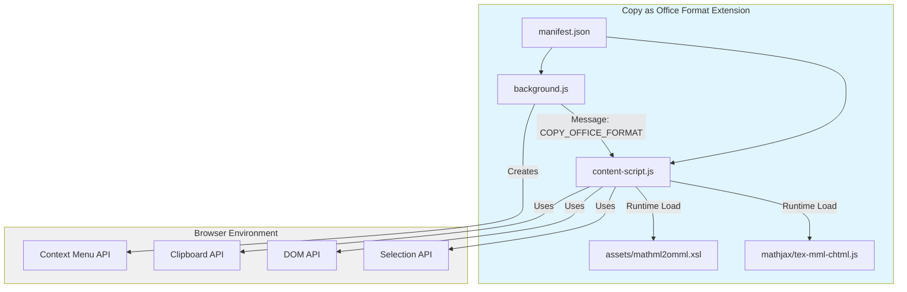
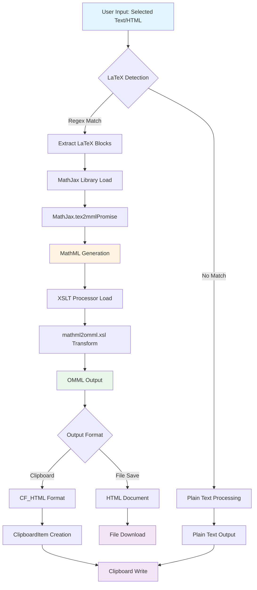
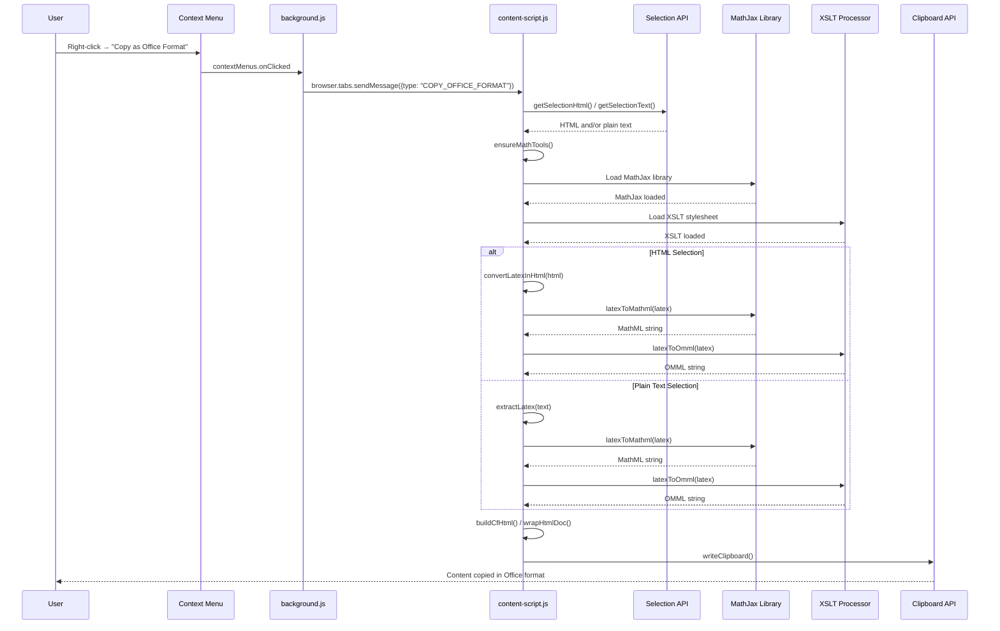
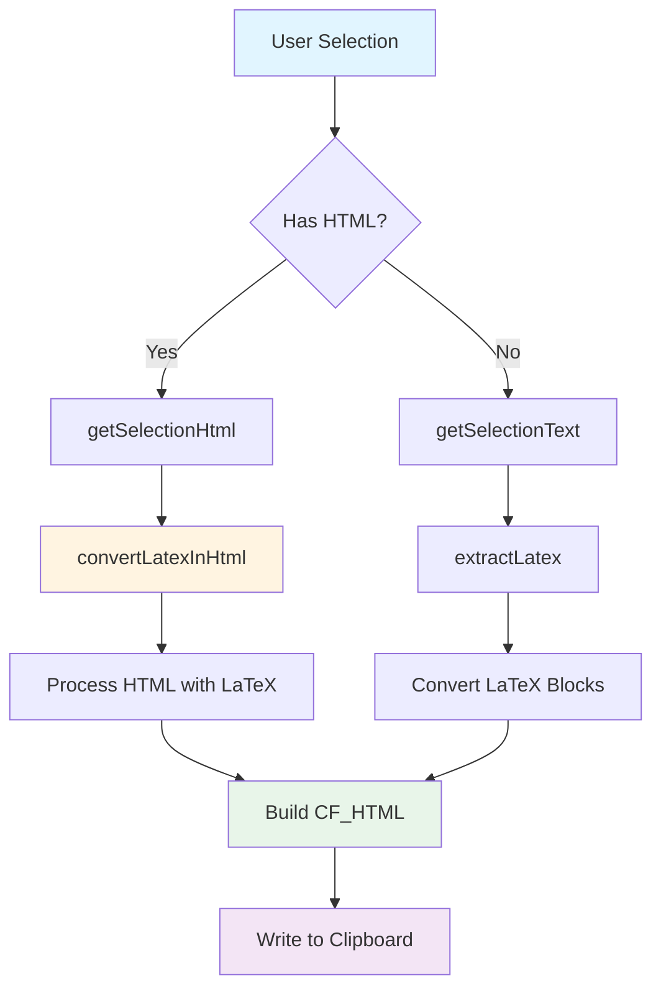
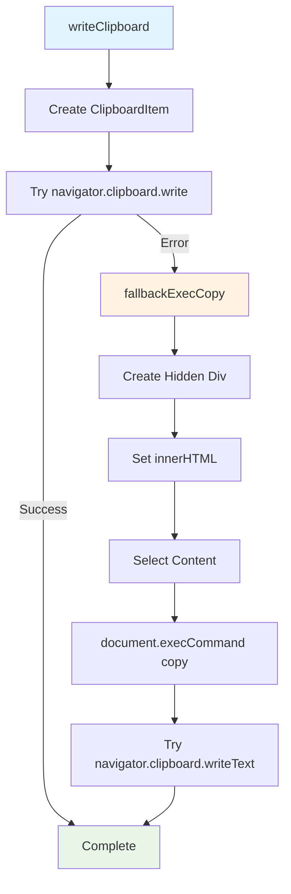

# Structural Schema Documentation

## Project Overview

This project contains a single Firefox extension for copying browser selections to the clipboard in Office-compatible format:

**Extension**: "Copy as Office Format" - Copies selected browser text to clipboard in Office-compatible format (CF_HTML), preserving formatting and converting LaTeX formulas to Microsoft Office Math (OMML) format.

The extension works on any website and intelligently preserves HTML structure while converting LaTeX mathematical notation to Office-compatible formats.

---

## 1. Directory Tree Structure

```
_FF_Ext_Copy/
├── manifest.json                    # Extension manifest (Manifest V2)
├── background.js                    # Background script (context menu)
├── content-script.js                # Content script (selection processing)
├── assets/
│   └── mathml2omml.xsl             # MathML to OMML XSLT transformer
├── mathjax/
│   └── tex-mml-chtml.js            # MathJax library for LaTeX→MathML conversion
├── icons/
│   ├── icon48.png                  # Extension icon (48x48)
│   └── icon96.png                  # Extension icon (96x96)
├── archive/                         # Archived previous versions
│   └── ai-chat-exporter/           # Previous AI Chat Exporter extension
├── example.png                     # Example image
└── docs/
    └── Plan for a Firefox Extension to Export AI Chats to OpenDocument Format.docx
```

---

## 2. Component Relationship Diagram



---

## 3. Data Flow Architecture

### 3.1 LaTeX Conversion Pipeline



### 3.2 Extension Message Flow



---

## 4. Function Dependency Map

### 4.1 Extension Functions

```mermaid
graph TD
    A[handleCopy] --> B[getSelectionHtml]
    A --> C[getSelectionText]
    A --> D[ensureMathTools]
    A --> E[convertLatexInHtml]
    A --> F[extractLatex]
    A --> G[writeClipboard]
    
    B --> H[Selection API]
    C --> H
    
    D --> I[Load MathJax]
    D --> J[Load XSLT]
    
    E --> K[processRoot]
    E --> L[latexToMathml]
    E --> M[latexToOmml]
    E --> N[isExcluded]
    E --> O[appendStringAsNodes]
    
    F --> P[Enhanced Regex Pattern]
    P --> Q[$...$ or \[...\] or \(...\) or \begin...\end]
    
    M --> L
    M --> R[XSLTProcessor.transformToDocument]
    
    G --> S[wrapHtmlDoc]
    G --> T[buildCfHtml]
    G --> U[fallbackExecCopy]
    G --> V[stripTags]
    
    A --> W[escapeHtml]
    A --> X[combineFragments]
    X --> G
    
    style A fill:#e1f5ff
    style E fill:#fff4e1
    style M fill:#e8f5e9
    style G fill:#f3e5f5
```

---

## 5. API Usage Map

### 5.1 Browser Extension APIs

| API | Usage Location | Purpose |
|-----|---------------|---------|
| `browser.runtime.onInstalled` | `background.js` | Initialize context menus on extension install |
| `browser.contextMenus.create` | `background.js` | Create right-click menu items |
| `browser.contextMenus.onClicked` | `background.js` | Handle context menu clicks |
| `browser.tabs.sendMessage` | `background.js` | Send messages to content scripts |
| `browser.runtime.onMessage` | `content-script.js`, `background.js` | Receive messages from other extension parts |
| `browser.runtime.getURL` | `content-script.js` | Get URLs for web-accessible resources |
| `browser.runtime.sendMessage` | `content-script.js` | Not used (no file save feature) |

### 5.2 Web APIs

| API | Usage Location | Purpose |
|-----|---------------|---------|
| `navigator.clipboard.write` | `content-script.js` | Write to clipboard (primary method) |
| `navigator.clipboard.writeText` | `content-script.js` | Write plain text to clipboard (fallback) |
| `ClipboardItem` | `content-script.js` | Create multi-format clipboard items |
| `document.execCommand('copy')` | `content-script.js` | Legacy clipboard fallback |
| `window.getSelection` | `content-script.js` | Get user text selection |
| `DOMParser` | `content-script.js` | Parse XML/XSLT documents |
| `XSLTProcessor` | `content-script.js` | Transform MathML to OMML |
| `XMLSerializer` | `content-script.js` | Serialize XML documents to strings |
| `document.createTreeWalker` | `content-script.js` | Traverse DOM nodes for LaTeX detection in HTML |
| `Range.cloneContents` | `content-script.js` | Preserve HTML structure from selection |

### 5.3 External Resources

| Resource | Location | Purpose |
|----------|----------|---------|
| `mathjax/tex-mml-chtml.js` | Runtime loaded | MathJax 3.x library for LaTeX→MathML conversion |
| `assets/mathml2omml.xsl` | Runtime loaded | XSLT stylesheet for MathML→OMML transformation |

---

## 6. Configuration Schema

### 6.1 Extension Manifest

```json
{
  "manifest_version": 2,
  "name": "Copy as Office Format",
  "version": "0.2.0",
  "description": "Copy browser selections to clipboard in Office-compatible format, preserving formatting and converting LaTeX formulas to Microsoft Equation (OMML) format.",
  "permissions": [
    "contextMenus",      // Create right-click menu
    "activeTab",         // Access current tab
    "clipboardWrite"     // Write to clipboard
  ],
  "background": {
    "scripts": ["background.js"],
    "persistent": false  // Event page (non-persistent)
  },
  "content_scripts": [{
    "matches": ["<all_urls>"],  // All websites
    "js": ["content-script.js"],
    "run_at": "document_idle"   // After DOM ready
  }],
  "web_accessible_resources": [
    "mathjax/tex-mml-chtml.js",
    "assets/mathml2omml.xsl"
  ],
  "icons": {
    "48": "icons/icon48.png",
    "96": "icons/icon96.png"
  },
  "applications": {
    "gecko": {
      "id": "copy-office-format@example"
    }
  }
}
```

### 6.2 Permission Analysis

| Permission | Extension | Purpose |
|------------|-----------|---------|
| `contextMenus` | ✓ | Create right-click menu items |
| `activeTab` | ✓ | Access current tab's DOM |
| `clipboardWrite` | ✓ | Write formatted content to clipboard |

---

## 7. LaTeX Processing Details

### 7.1 LaTeX Pattern Recognition

**Extension** (`content-script.js`):
- Enhanced pattern: `/(\\\[.*?\\\]|\\\(.*?\\\)|\\begin\{.*?\}[\s\S]*?\\end\{.*?\}|\$(.+?)\$)/g`
- Matches:
  - Inline: `$...$`
  - Display: `\[...\]` and `\(...\)`
  - Environments: `\begin{...}...\end{...}`
- Excludes LaTeX in CODE, PRE, KBD, SAMP, TEXTAREA elements

### 7.2 Conversion Pipeline


### 7.3 XSLT Transformation Rules

The `mathml2omml.xsl` file transforms MathML elements to OMML:

- `ml:mrow`, `ml:mstyle`, `ml:mphantom` → Pass through (apply templates)
- `ml:mi`, `ml:mn`, `ml:mo`, `ml:ms` → `m:r` (run) with `m:t` (text)
- `ml:msup` → `m:sSup` (superscript)
- `ml:msub` → `m:sSub` (subscript)
- `ml:msubsup` → `m:sSubSup` (subscript and superscript)
- `ml:mfrac` → `m:f` (fraction)
- Additional rules for matrices, roots, functions, etc.

---

## 8. Clipboard Format (CF_HTML)

The extension uses the CF_HTML (Clipboard Format HTML) specification for rich clipboard content compatible with Microsoft Office applications.

### 8.1 CF_HTML Structure

```
Version:1.0\r\n
StartHTML:0000000123\r\n
EndHTML:0000000456\r\n
StartFragment:0000000234\r\n
EndFragment:0000000345\r\n
SourceURL:https://example.com\r\n
<html>...<!--StartFragment-->...content...<!--EndFragment-->...</html>
```

### 8.2 Byte Offset Calculation

The extensions calculate byte offsets using `TextEncoder` to ensure accurate positioning:
- `StartHTML`: Byte position where HTML content begins
- `EndHTML`: Byte position where HTML content ends
- `StartFragment`: Byte position of fragment start marker
- `EndFragment`: Byte position of fragment end marker

This ensures Microsoft Office applications correctly parse the clipboard content.

---

## 9. Selection Processing

### 9.1 HTML Preservation

The extension preserves HTML structure from browser selections:
- Uses `Range.cloneContents()` to capture HTML structure
- Maintains inline styles and formatting
- Preserves document hierarchy when possible

### 9.2 Processing Flow



---

## 10. Error Handling & Fallbacks

### 10.1 Clipboard Write Fallback



### 10.2 LaTeX Conversion Error Handling

- Failed conversions fall back to original LaTeX text
- MathML generation errors are caught and logged
- OMML transformation errors fall back to MathML
- Excluded elements (CODE, PRE, etc.) skip LaTeX processing

---

## 11. Resource Loading Strategy

The extension uses lazy loading for external resources:

1. **MathJax**: Loaded only when needed (first LaTeX conversion)
2. **XSLT**: Loaded once and cached in promise
3. **Runtime URLs**: Accessed via `browser.runtime.getURL()` for web-accessible resources

This minimizes initial load time and memory usage.

---

## Summary

This project implements a single Firefox extension focused on copying browser selections to the clipboard in Office-compatible format:

- **Extension**: "Copy as Office Format" - Preserves HTML formatting and converts LaTeX formulas to Microsoft Office Math (OMML) format

Key features:
- Works on any website (universal selection support)
- Preserves HTML structure and formatting from selections
- Enhanced LaTeX detection supporting multiple formats (`$...$`, `\[...\]`, `\(...\)`, `\begin...\end`)
- Converts LaTeX to OMML for Microsoft Office compatibility
- Uses CF_HTML clipboard format with accurate byte offsets
- Robust error handling and fallback mechanisms

The extension leverages:
- MathJax for LaTeX parsing and MathML generation
- XSLT for MathML→OMML transformation
- CF_HTML for Office-compatible clipboard format
- Lazy loading of resources for optimal performance

The architecture is modular, with clear separation between background scripts (context menu handling) and content scripts (selection processing, LaTeX conversion, and clipboard operations).

