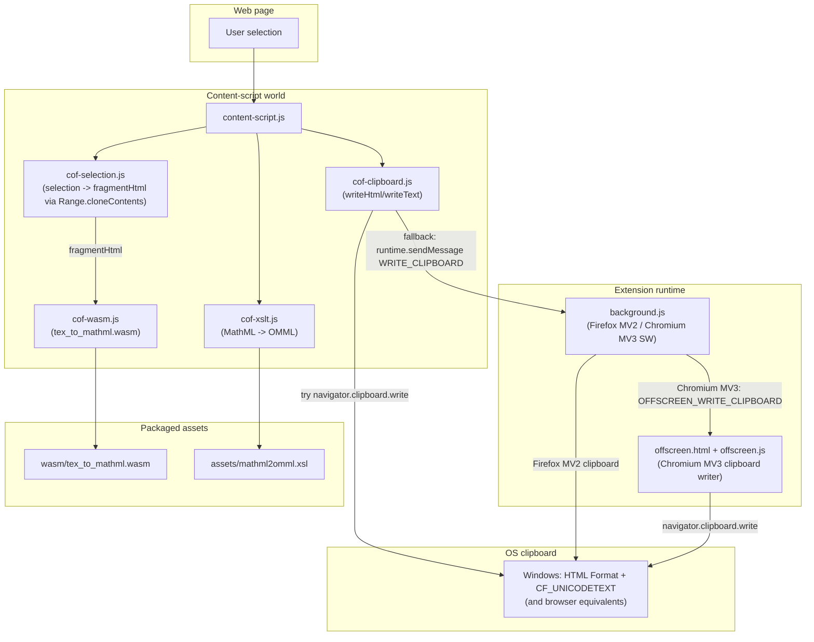
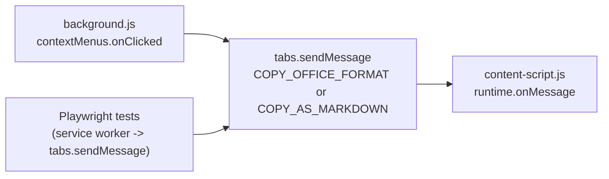
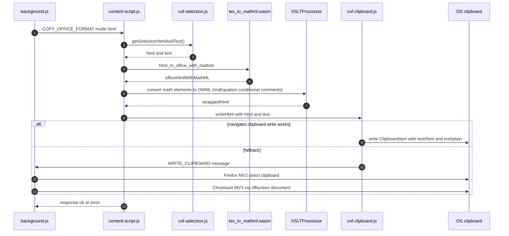
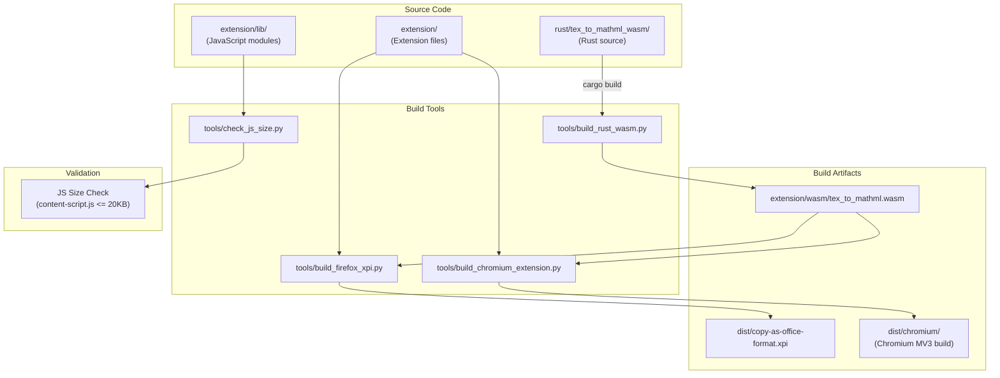
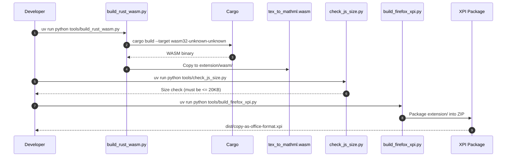
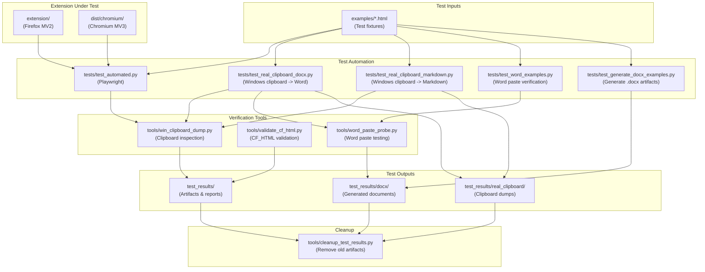
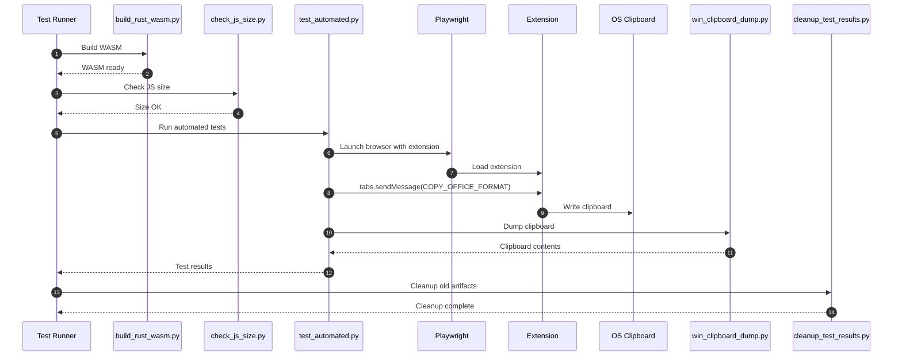

# `extension/content-script.js` - Data/Control Flow

> **Note:** These Mermaid diagrams may not render in Cursor's markdown preview. They work in:
> - Chat/Plan Mode (inline rendering)
> - [Mermaid Live Editor](https://mermaid.live/) (copy/paste diagram code)
> - GitHub (when viewing on GitHub)
> - VS Code with Mermaid extension

This diagram documents the runtime path from "user selects text" to "Office-compatible HTML is on the OS clipboard".

## Components

## Entry points

## Copy as Office (HTML) pipeline

## Test verification (deterministic)

- Tests never rely on any "native selection copy" behavior.
- Tests trigger copy via the same `tabs.sendMessage` path and verify the real OS clipboard using `tools/win_clipboard_dump.py`.

## Build Workflow

## Build Pipeline Sequence

## Testing Workflow

## Testing Pipeline Sequence

