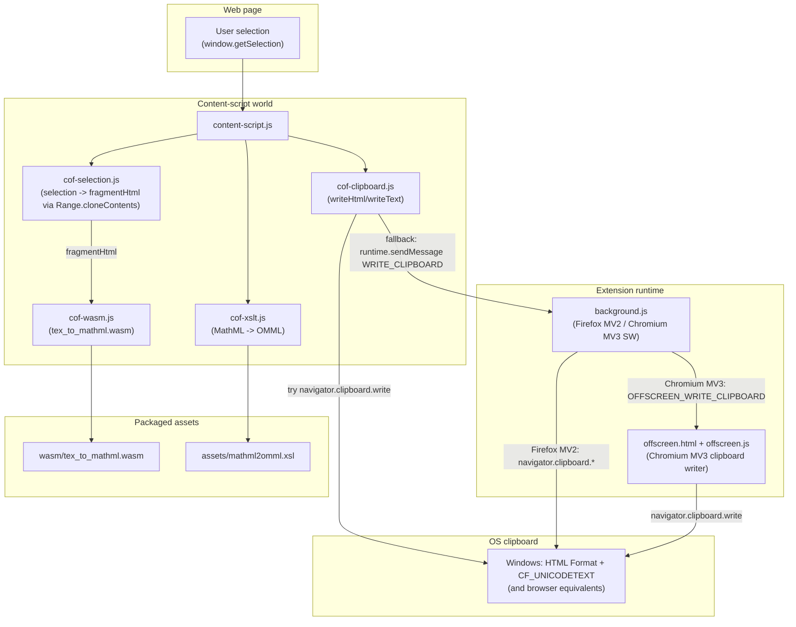
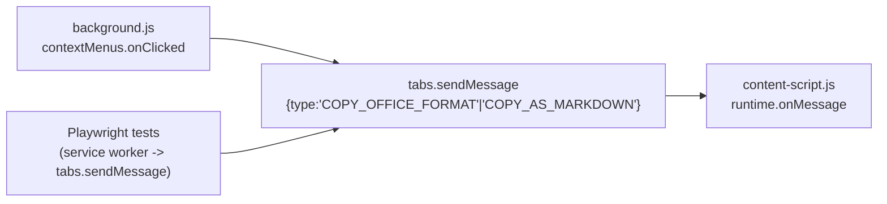
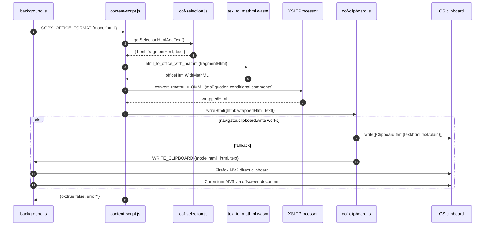

# `extension/content-script.js` - Data/Control Flow

This diagram documents the runtime path from “user selects text” to “Office-compatible HTML is on the OS clipboard”.

## Components

## Entry points

## Copy as Office (HTML) pipeline

## Test verification (deterministic)

- Tests never rely on any “native selection copy” behavior.
- Tests trigger copy via the same `tabs.sendMessage` path and verify the real OS clipboard using `lib/tools/win_clipboard_dump.py`.

