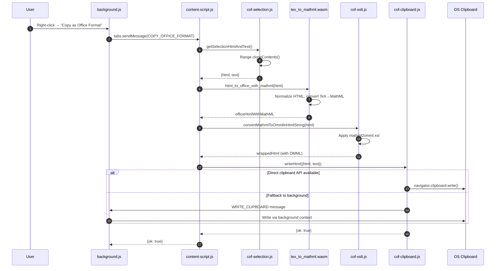
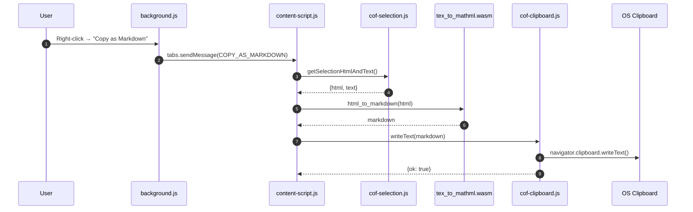

# Project Architecture

This document provides a comprehensive overview of the "GPT LATEX Ctrl-C Ctrl-V" Firefox extension architecture, including component relationships, data flows, build processes, and testing strategies.

## Overview

The extension enables users to copy browser selections as Office-compatible HTML, with automatic conversion of LaTeX/TeX math expressions to Microsoft Equation (OMML) format. The extension operates deterministically, using explicit APIs rather than relying on browser-native copy behavior.

## Key Design Principles

1. **Deterministic Pipeline**: All operations use explicit, inspectable mechanisms (e.g., `Range.cloneContents()` for selection, `navigator.clipboard.write()` for clipboard writes)
2. **No Native Copy Dependencies**: Never relies on browser's native "copy selection" behavior
3. **Observable Postconditions**: Every step produces verifiable artifacts (HTML snapshots, console logs, clipboard dumps)
4. **Fail Fast**: All failures produce debuggable diagnostics, no silent fallbacks

## Project Structure

```
.
├── extension/              # Firefox MV2 extension source
│   ├── content-script.js   # Main content script orchestrator
│   ├── background.js       # Background script (context menu, clipboard fallback)
│   ├── lib/                # Extension library modules
│   │   ├── cof-selection.js   # Selection extraction
│   │   ├── cof-wasm.js        # WASM loader and interface
│   │   ├── cof-xslt.js        # MathML -> OMML conversion
│   │   ├── cof-clipboard.js   # Clipboard write operations
│   │   ├── cof-ui.js          # UI feedback (toasts)
│   │   ├── cof-core.js        # Core utilities
│   │   └── cof-diag.js        # Diagnostics
│   ├── assets/
│   │   └── mathml2omml.xsl    # XSLT stylesheet for MathML->OMML
│   └── wasm/
│       └── tex_to_mathml.wasm # Compiled Rust WASM module
├── rust/                   # Rust source code
│   ├── tex_to_mathml_wasm/   # Main WASM crate
│   │   ├── src/
│   │   │   ├── lib.rs          # WASM exports
│   │   │   ├── tex.rs          # TeX -> MathML conversion
│   │   │   ├── markdown.rs     # Markdown parsing
│   │   │   ├── office.rs       # HTML -> Office HTML normalization
│   │   │   └── ...
│   │   └── Cargo.toml
│   └── docx_from_html/        # Standalone tool for DOCX generation
├── tools/                  # Build and utility scripts
│   ├── build_rust_wasm.py     # Compile Rust -> WASM
│   ├── build_firefox_xpi.py   # Package extension as XPI
│   ├── build_chromium_extension.py  # Build Chromium MV3 variant
│   ├── check_js_size.py       # Enforce size budget
│   └── ...
├── tests/                  # Test suite
│   ├── test_automated.py       # Playwright-based automation
│   ├── test_real_clipboard_*.py  # Real clipboard tests
│   └── ...
└── examples/              # Test fixtures (HTML files)
```

## Component Architecture

### Extension Components

#### Content Script (`extension/content-script.js`)
- **Role**: Main orchestrator for copy operations
- **Responsibilities**:
  - Listen for `COPY_OFFICE_FORMAT` and `COPY_AS_MARKDOWN` messages
  - Coordinate selection extraction, WASM processing, XSLT conversion, and clipboard write
  - Handle errors and provide user feedback

#### Background Script (`extension/background.js`)
- **Role**: Extension lifecycle and clipboard fallback
- **Responsibilities**:
  - Create context menu entries
  - Handle clipboard writes when content script cannot (Firefox MV2 direct, Chromium MV3 via offscreen document)
  - Manage offscreen document for Chromium MV3

#### Library Modules (`extension/lib/`)

**cof-selection.js**
- Extracts HTML and text from user selection using `Range.cloneContents()`
- Handles special cases (e.g., "View Source" pages)
- Returns `{html, text}` object

**cof-wasm.js**
- Loads and interfaces with `tex_to_mathml.wasm`
- Provides `html_to_office_with_mathml()`, `markdown_to_office_with_mathml()`, `html_to_markdown()` functions
- Manages WASM memory allocation/deallocation

**cof-xslt.js**
- Converts MathML elements to OMML using XSLT transformation
- Wraps OMML in Microsoft Office conditional comments
- Uses `assets/mathml2omml.xsl` stylesheet

**cof-clipboard.js**
- Attempts direct clipboard write via `navigator.clipboard.write()`
- Falls back to background script if direct write fails
- Supports both HTML and plain text modes

**cof-ui.js**
- Displays toast notifications for success/failure
- Non-blocking user feedback

**cof-core.js**
- Browser API abstraction (`browser` vs `chrome`)
- Root element management
- Utility functions

**cof-diag.js**
- Diagnostic logging (disabled in production)
- Error tracking

### Rust/WASM Components

#### `rust/tex_to_mathml_wasm/`
- **Purpose**: Core conversion engine compiled to WebAssembly
- **Key Functions**:
  - `html_to_office_with_mathml(html: string) -> string`: Normalizes HTML for Office and converts TeX to MathML
  - `markdown_to_office_with_mathml(markdown: string) -> string`: Parses Markdown and converts to Office HTML with MathML
  - `html_to_markdown(html: string) -> string`: Converts HTML to Markdown
- **Dependencies**:
  - `latex2mathml`: TeX/LaTeX to MathML conversion
  - `pulldown-cmark`: Markdown parsing
  - `html5ever`: HTML parsing and normalization
- **API Version**: Currently version 3 (checked at runtime)

## Runtime Data Flow

### Copy as Office Format (HTML Selection)



### Copy as Markdown



## Build Workflow

### Build Pipeline

The build process transforms source code into distributable packages:

1. **Rust → WASM**: Compile Rust crate to WebAssembly
2. **Size Validation**: Ensure content script stays within 20KB budget
3. **Package Extension**: Create XPI (Firefox) or Chromium build

See [diagram.md](../diagram.md) for detailed build workflow diagrams.

### Build Commands

```bash
# Build WASM
uv run python tools/build_rust_wasm.py

# Check JS size
uv run python tools/check_js_size.py

# Build Firefox XPI
uv run python tools/build_firefox_xpi.py --out dist/copy-as-office-format.xpi

# Build Chromium extension (for testing)
uv run python tools/build_chromium_extension.py
```

### Build Artifacts

- `extension/wasm/tex_to_mathml.wasm`: Compiled WASM module
- `dist/gpt-latex-ctrl-c-v.xpi`: Firefox extension package
- `dist/chromium/`: Chromium MV3 extension build (for testing)

## Testing Strategy

### Test Types

1. **Automated Tests** (`tests/test_automated.py`):
   - Playwright-based end-to-end tests
   - Tests extension functionality in Chromium
   - Verifies clipboard contents deterministically

2. **Real Clipboard Tests** (`tests/test_real_clipboard_*.py`):
   - Windows-only tests that interact with real OS clipboard
   - Paste into Microsoft Word and verify results
   - Generate inspectable artifacts

3. **Word Verification** (`tests/test_word_examples.py`):
   - Tests paste results in Microsoft Word
   - Skips if Word is unavailable
   - Validates equation editability

4. **Document Generation** (`tests/test_generate_docx_examples.py`):
   - Generates `.docx` files from test fixtures
   - Creates deterministic output artifacts

### Test Inputs

All tests consume only `examples/*.html` files as inputs. No HTML fixtures are stored under `tests/`.

### Test Execution

```bash
# Run all automated tests
tests/run_tests.bat  # Windows
tests/run_tests.sh   # Linux/Mac

# Individual test suites
uv run python tests/test_automated.py
uv run python tests/test_real_clipboard_docx.py --out-root test_results/real_clipboard
```

### Test Artifacts

- `test_results/docx/`: Generated Word documents
- `test_results/real_clipboard/`: Clipboard dumps and validation reports
- `test_results/real_clipboard_markdown/`: Markdown clipboard artifacts

See [diagram.md](../diagram.md) for detailed testing workflow diagrams.

## Key Design Decisions

### Deterministic Clipboard Operations

The extension never uses `document.execCommand('copy')` or relies on browser-native copy behavior. Instead:

1. Selection is extracted explicitly via `Range.cloneContents()`
2. Clipboard writes use `navigator.clipboard.write()` or explicit background script fallback
3. All operations produce verifiable artifacts

### WASM for Core Conversions

Rust/WASM is used for:
- TeX/LaTeX → MathML conversion
- HTML normalization for Office compatibility
- HTML ↔ Markdown conversion

This ensures:
- Deterministic, reproducible conversions
- Performance for large selections
- Single source of truth for conversion logic

### XSLT for MathML → OMML

Microsoft's standard XSLT stylesheet (`mathml2omml.xsl`) is used to convert MathML to OMML. The extension:
1. Converts TeX → MathML (via WASM)
2. Applies XSLT transformation (via `XSLTProcessor`)
3. Wraps OMML in Office conditional comments

### Multi-Browser Support

- **Firefox MV2**: Primary target, uses direct background script clipboard access
- **Chromium MV3**: Test target, uses offscreen document for clipboard writes

The extension abstracts browser API differences in `cof-core.js`.

## Extension Manifest

### Firefox MV2 (`extension/manifest.json`)

- **Manifest Version**: 2
- **Permissions**: `contextMenus`, `activeTab`, `clipboardWrite`
- **Content Scripts**: Injected into all pages (`<all_urls>`)
- **Web Accessible Resources**: WASM file and XSLT stylesheet

### Chromium MV3 (`extension/manifest.chromium.json`)

- **Manifest Version**: 3
- **Service Worker**: `background.js` runs as service worker
- **Offscreen Document**: Used for clipboard writes
- **Permissions**: Similar to MV2, adapted for MV3 API

## Dependencies

### Python Dependencies (`pyproject.toml`)

- `playwright==1.57.0`: Browser automation for tests
- `pyperclip==1.11.0`: Clipboard access (Windows tests)
- `selenium==4.39.0`: Alternative browser automation

### Rust Dependencies (`rust/tex_to_mathml_wasm/Cargo.toml`)

- `latex2mathml=0.2.3`: TeX to MathML conversion
- `pulldown-cmark=0.12.0`: Markdown parsing
- `html5ever=0.36.1`: HTML parsing
- `markup5ever_rcdom=0.36.0`: HTML DOM representation

All dependencies are pinned to specific versions for determinism.

## Performance Considerations

### Size Budgets

- **Content Script**: Hard limit of 20KB (`extension/content-script.js`)
- Enforced by `tools/check_js_size.py`

### WASM Loading

- WASM module is loaded lazily on first use
- Cached in memory for subsequent operations
- ~200KB compiled size

### Selection Size Limits

- Default max input: 25,000,000 characters (configurable via `CONFIG.MAX_WASM_INPUT_CHARS`)
- Large selections may take several seconds to process

## Security Considerations

### Content Security

- Extension uses isolated content script context
- No eval() or dynamic code execution
- WASM module is loaded from extension package (not external)

### Clipboard Access

- Requires `clipboardWrite` permission
- Only writes when user explicitly triggers copy action
- No automatic clipboard monitoring

### Privacy

- All processing happens locally in the browser
- No network requests
- No data collection or telemetry

See [PRIVACY.md](PRIVACY.md) for detailed privacy policy.

## Debugging

### Diagnostic Tools

- `tools/win_clipboard_dump.py`: Inspect Windows clipboard contents
- `tools/validate_cf_html.py`: Validate CF_HTML clipboard format
- `tools/capture_extension_payload.py`: Capture extension clipboard payloads

### Debug Mode

Set `DEBUG = true` in `extension/background.js` and `extension/content-script.js` for verbose logging.

See [debugging/](debugging/) for detailed debugging guides.

## Future Considerations

### Potential Enhancements

1. **Manifest V3 Migration**: Full MV3 support for Firefox (when available)
2. **Additional Math Formats**: Support for AsciiMath, MathML input
3. **Performance Optimization**: Streaming processing for very large selections
4. **Additional Office Formats**: Support for Excel, PowerPoint paste formats

### Maintenance Notes

- Rust/WASM API version must match between `rust/tex_to_mathml_wasm/src/lib.rs` and `extension/content-script.js`
- XSLT stylesheet version should be tracked if updated
- Test fixtures in `examples/` should be preserved for regression testing

## Related Documentation

- [diagram.md](../diagram.md): Visual workflow diagrams
- [AGENTS.md](../AGENTS.md): Development guidelines and rules
- [README.md](../README.md): Quick start guide
- [docs/testing/README.md](testing/README.md): Testing documentation
- [docs/debugging/](debugging/): Debugging guides

